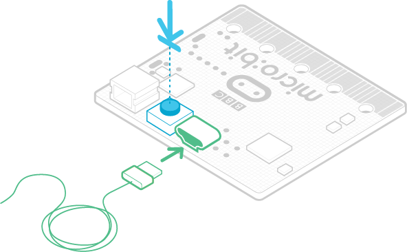
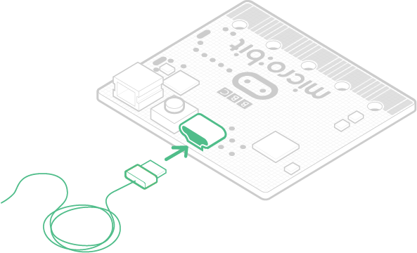

# Troubleshooting DAPLink

## Maintenence mode on micro:bit (KL26Z)

If you have a BBC micro:bit, or other Mbed hardware, and it is connecting as a drive called MAINTENANCE instead of MICROBIT, then you are in the maintenance mode provided for updating the DAPLink software (see below).

The way you access maintenance mode is by pluging in your board to your computer's USB port while holding down the reset button. If you are in maintenance mode by mistake, this might be how it happened.

To leave maintenance mode, unplug the board from USB, make sure the Reset button is not pressed, and plug the board back in.

The board should now show up with the correct name (for example, MICROBIT). If this fails to work, please follow the [firmware update steps](https://microbit.org/get-started/user-guide/firmware/) outlined on the micro:bit website.
